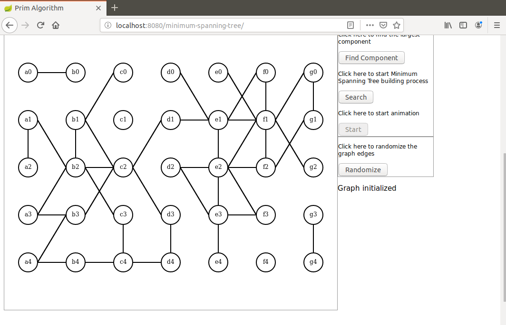
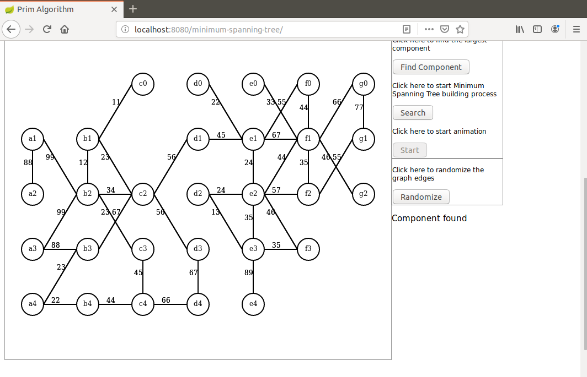
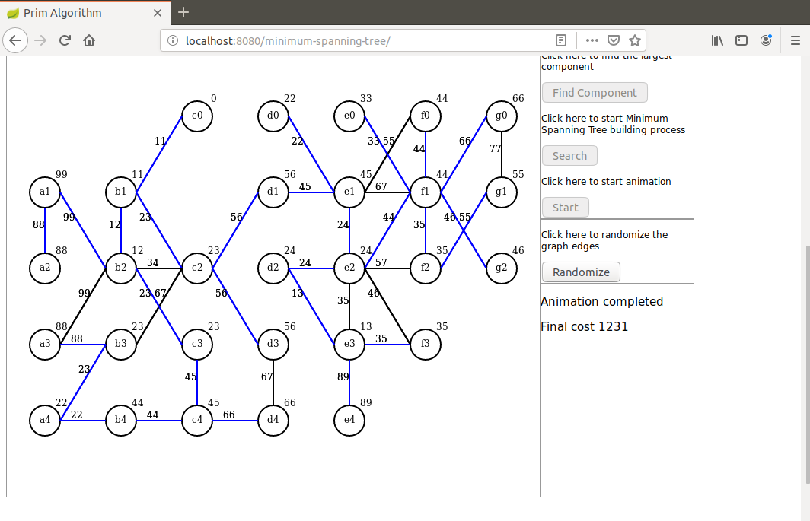

# prim-restful
I present here a Java demo of the Minimum Spanning Tree using a parallelizable implementation of Prim algorithm.

Here are the prerequisites to run this demo:

A recent Maven version installed (I use 3.6.0).
A recent Docker version installed (I use 17.12.1-ce)

The algorithm itself is implemented in Java, Javascript is only used for initialization and display on Canvas.

First an undirected graph is randomly created and its largest connected component is extracted (Java side).

Then a minimum spanning tree is built (Java side) with all intermediate results saved as a collection.

This collection is then sent to the browser as a JSON object.

The collection is used for an animated display (browser side).

In this version the algorithm is implemented by three workers running in Docker containers and a supervisor. All communication between supervisor and worker is RESTful. The task partitioning between supervisor and workers closely follows the description given in this textbook:

Guide to Graph Algorithms, K. Erciyes, Springer

Here are the ports used in the demo:

supervisor: 8080

workers: 8081,8082,8083

# Building Docker image
To build the Docker image run the command `mvn clean package docker:build` in subdirectory worker. It builds a docker image named prim/worker.

# Launching the demo

## Launching the workers
To launch the worker run the command `docker-compose up` in subdirectory docker.

## Launching the supervisor
To launch the supervisor run the command `mvn spring-boot:run` in subdirectory supervisor.

When the application has started open a browser and hit URL `http://localhost:8080/minimum-spanning-tree`.

Here are some screen shots that can be seen in this demo.

After graph initialization:

After the component was found:

After the end of the animation:

Dominique Ubersfeld, Cachan, France
